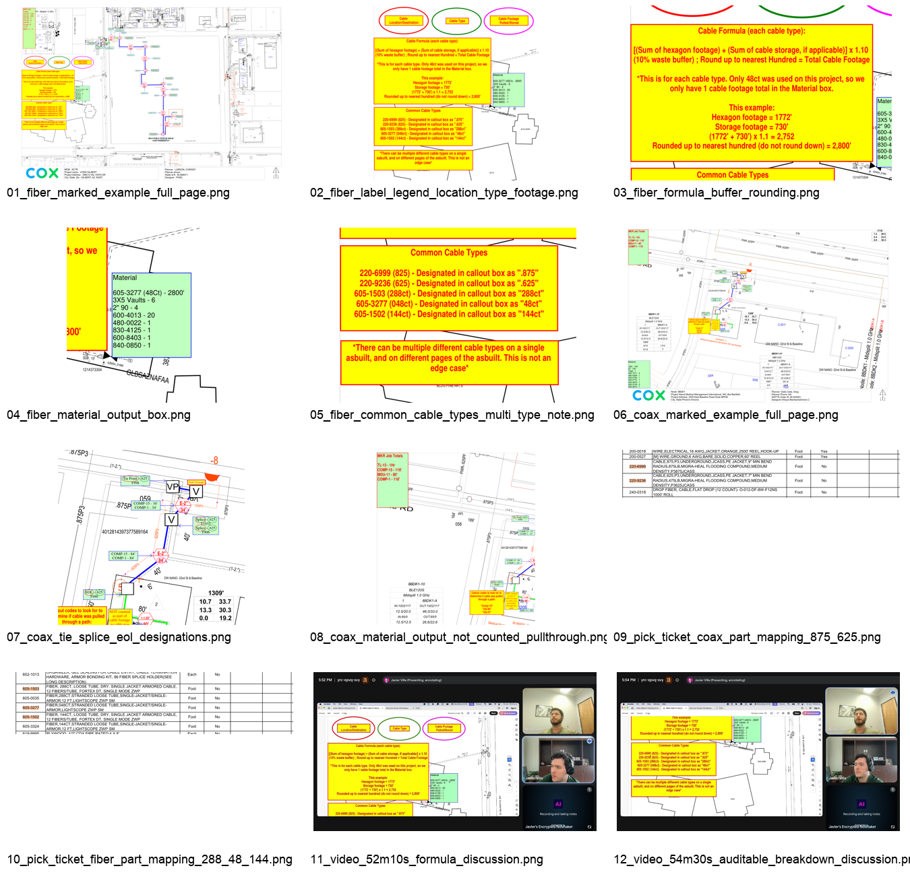

# As-Built Cable Footage Material Upgrade Brief

## Purpose

Nick wants the as-built summation app to add cable/fiber material footage counts, not just MKR billing-code totals. The feature should read the drawing callouts, group cable by type, calculate the required footage, map the cable type to the right material/part line, and show the calculation path in the web app so the result can be audited quickly.

This is a planning brief only. No implementation code has been changed.

## Evidence Reviewed

- `Telcyte & AI Daddy - Weekly Sync - Jun 16 2026.mp4`, focused on 46:45-57:00.
- `cropped transcript.rtf`, especially 46:45-56:50.
- `nick email.rtf`.
- `FIBER-ASBUILT-(TelCyte)-BI-888071 - Cable Footage Count.pdf`.
- `COAX-ASBUILT-(TelCyte)-BI-945091 - Cable Footage Count.pdf`.
- `Short List TelCyte COX Material Pick Ticket_v.06162026.pdf`.
- Nick email reply on June 16, 2026 confirming the coax formula, final line format, and Materials box placement.
- Current repo flow in `app/pdf_parser.py`, `app/openrouter_client.py`, `app/models.py`, `app/main.py`, `app/pdf_annotator.py`, and `static/app.js`.

## Snapshot Evidence

Snapshots are saved in `docs/asbuilt-cable-footage-upgrade/snapshots/`.

| Snapshot | Source | What It Shows |
|---|---|---|
| `01_fiber_marked_example_full_page.png` | Fiber PDF, page 1 | Full marked fiber example with material box, cable labels, and formula notes. |
| `02_fiber_label_legend_location_type_footage.png` | Fiber PDF, page 1 | Nick's labels: cable location/destination, cable type, cable footage pulled/stored. |
| `03_fiber_formula_buffer_rounding.png` | Fiber PDF, page 1 | Fiber formula: path footage + storage, 10% buffer, round up to nearest hundred. |
| `04_fiber_material_output_box.png` | Fiber PDF, page 1 | Example final material output: `605-3277 (48Ct) - 2800'`. |
| `05_fiber_common_cable_types_multi_type_note.png` | Fiber PDF, page 1 | Cable type to part mapping and Nick's note that multiple cable types/pages are not edge cases. |
| `06_coax_marked_example_full_page.png` | Coax PDF, page 1 | Full marked coax example. |
| `07_coax_tie_splice_eol_designations.png` | Coax PDF, page 1 | Coax cable designations: tie point, splice, EOL, `.625`. |
| `08_coax_material_output_not_counted_pullthrough.png` | Coax PDF, page 1 | Coax material output and explicit pull-through/not-counted guidance. |
| `09_pick_ticket_coax_part_mapping_875_625.png` | Pick-ticket PDF, page 1 | `.875` and `.625` cable part numbers. |
| `10_pick_ticket_fiber_part_mapping_288_48_144.png` | Pick-ticket PDF, page 2 | `288ct`, `48ct`, and `144ct` fiber part numbers. |
| `11_video_52m10s_formula_discussion.png` | Meeting video, 52:10 | Meeting frame while formula and material output are being discussed. |
| `12_video_54m30s_auditable_breakdown_discussion.png` | Meeting video, 54:30 | Meeting frame when the app-visible calculation breakdown is discussed. |

## Current Understanding

Nick uses "cable" to mean both fiber and coax. The valuable automation is the cable footage calculation because other materials depend more heavily on project-specific field knowledge.

The app should identify cable runs from as-built callouts, calculate footage by cable type, and produce material rows. It should not combine all cable into one total. One as-built can contain multiple cable types and multiple pages, and Nick explicitly said that is not an edge case.

The calculation should be visible in the web app. Nick does not normally include the full calculation on the final PDF; it is there in the example mainly to explain the logic. The app should expose the breakdown for review/audit, while the PDF output can stay focused on the final totals/material lines unless a clean product decision says otherwise.

## Calculation Rules

### Cable Type Detection

Cable type appears inside callouts, for example:

- Fiber: `48Ct`, `144Ct`, `288Ct`.
- Coax: `.625`, `.875`.

Normalize display casing, but preserve the meaning. Count each cable type separately.

### Fiber

Fiber is not cut at every vault. It can include storage footage looped inside vaults/pads/splice locations.

Nick's fiber example says:

- Hexagon/path footage: `1772'`.
- Storage footage: `730'`.
- Formula: `(path footage + storage footage) x 1.10`.
- Then round up to the nearest hundred feet.
- Example result: `(1772 + 730) x 1.10 = 2752`, rounded up to `2800'`.
- Material output: `605-3277 (48Ct) - 2800'`.

Evidence check: the `1772'` path total matches the six pulled/path callouts in the fiber example (`290 + 270 + 336 + 124 + 200 + 552`). The `730'` storage total is not just the six `Storage - 48Ct - 100'` labels; it appears to be `600'` of explicit storage plus `Tie Point - 48Ct - 100'` and `EOL - 48Ct - 30'`. Confirm with Nick that tie-point and EOL slack belong in the storage bucket.

The implementation should keep path footage and storage footage separate in the breakdown, then show subtotal, buffer, and rounded final amount.

### Coax

Coax generally does not include storage footage. Nick explained that coax is cut/spliced, and the as-built measures from cable end to cable end with enough slack for splicing.

The coax example uses designations such as:

- `Tie Point - .625`
- `Splice - .625`
- `EOL - .625`

The coax sample also says some paths are not counted if cable was not pulled through that path. It calls out `Comp-15`, `UG-56`, and `UG-57` as evidence that cable was pulled through a path. Treat those as inclusion signals, not as the cable-footage source by themselves.

Nick confirmed the coax rule by email: use pulled path footage only, no storage, add 10%, then round using the normal coax rule. He also confirmed the final material line should include the part number, for example `220-9236 (.625) - 140'`.

Important remaining risk: the visible text evidence in the sample only explains `118'` of pulled path, while Nick's expected material output is `140'` after buffer/rounding. That means the formula is confirmed, but the source-path reconstruction is still under-determined for this coax sample. Do not hard-code the `140'`; keep coax review-safe until the parser can explain the pulled path or Nick supplies the missing path evidence.

## Material Mapping

Use the pick-ticket/common cable mapping for final material rows:

- `.875` -> `220-6999`.
- `.625` -> `220-9236`.
- `288ct` -> `605-1503`.
- `48ct` -> `605-3277`.
- `144ct` -> `605-1502`.

Mapping caveats:

- Final material lines should include part number + cable type + footage, e.g. `605-3277 (48Ct) - 2800'` and `220-9236 (.625) - 140'`.
- The fiber annotation appears to label `220-6999` as `(825)`, but the callout string is `.875` and the pick ticket confirms this is 875 cable. Key the mapping from the callout string, not the parenthetical typo.
- The pick ticket also lists alternates for some fiber counts: `288ct` can appear near `605-0035`, and `144ct` can appear near `605-3324`. The highlighted or "Use Until Notified Otherwise" row should be treated as canonical unless Nick says otherwise.
- The current repo has highlight-aware rate-card parsing, but it extracts billing codes, not cable type-to-part mappings. Reuse the idea, not the exact output shape.

If a cable type is detected but the part number is missing or ambiguous, the run should not silently guess. Show a review item or at least a high-visibility warning.

## Where This Fits In The Current App

The current app already has a good shape for this upgrade:

- The deterministic parser extracts positioned text blocks from page text and FreeText annotations.
- The parser currently totals MKR billing codes, while material extraction is only a candidate list.
- The model is used as a reviewer, not as the sole source of truth.
- `SummaryResult` already has a `materials` list, but materials are currently treated as phase-two and `INCLUDE_MATERIALS` defaults off.
- The upload UI already has a result-summary area that can show materials, notes, warnings, and result lines.
- The run history stores result lines and can support later audit/replay.

Important existing behavior to change: `EOL`, `Tie Point`, `Storage`, and `Pull through` are currently matched by `UNRESOLVED_CALLOUT_PATTERN` in `app/pdf_parser.py` and can force manual review. This upgrade must re-scope those words from "always unresolved" to "structured cable evidence when type/footage can be safely interpreted, review item only when ambiguous."

Recommended shape: add a structured cable-material result internally, then render it into user-facing materials and a web UI breakdown. Avoid making cable calculations a loose string-only feature.

Do not disturb the existing MKR Job Totals behavior. Cable footage should be an additive material feature, not a rewrite of the billing-code summation path.

## Hardest Engineering Risk

The labeled cable callouts are relatively straightforward: examples like `Storage - 48Ct - 100'`, `Tie Point - 48Ct - 100'`, and `EOL - 48Ct - 30'` contain both type and footage.

The hard part is path/hexagon footage role assignment, not simply reading the numbers. On the fiber sample, the path/hexagon total is fully reconstructable from text: the six `Comp-15` callouts add to `1772'`, exactly matching Nick's example. Do not sum every code named in the legend: `UG-56` and `UG-57` are pull-through inspection cues, not footage addends by default.

The coax sample is different. The visible de-duplicated `Comp-15` path evidence explains `118'`, while Nick's final line is `220-9236 (.625) - 140'`. So the parser needs a role/reconciliation layer: read the configured path code, exclude roll-up/stamped boxes, avoid adding cue-only codes, and degrade to Review when the path evidence does not explain the final material footage.

Recommended sequencing:

1. First pass: support labeled storage/slack callouts and a single configured cable-bearing path code such as `Comp-15`, using the same de-dup/stamped-box exclusion as billing but without inheriting rate-card filters.
2. Second pass: handle under-determined coax and multi-type sheets with review-safe reconciliation. Geometry or page-image review can be a capped fallback/cross-check, not the primary method.
3. Unknown attribution should show a Review item and omit the uncertain material line rather than guessing.

## Desired Web UI Behavior

After upload, the result panel should show a "Cable Materials" or "Material Footage" breakdown with one row per cable type:

- Cable type.
- Part number.
- Final rounded footage.
- Source pages/callouts used.
- Path footage subtotal.
- Storage footage subtotal, if any.
- Buffer used.
- Rounding rule.
- Confidence/review notes.

Example fiber row:

- `48Ct / 605-3277`
- Path footage: `1772'`
- Storage footage: `730'`
- Buffer: `10%`
- Rounded output: `2800'`

This breakdown is the fast audit path. It should be visible in the app even if the final PDF only shows the material line.

## Output Placement

Likely output:

- Keep `MKR Job Totals` for billing-code totals.
- Add a separate PDF text box titled `Materials` when cable material confidence is high and stamping is enabled.
- Prefer the bottom-left corner for the `Materials` box as long as it does not block callouts. Use the same replacement, obstacle-avoidance, and movable FreeText behavior as the MKR totals box.
- Match the sample Material-box styling: light green fill, blue outline, black text. Do not use the red MKR totals text style for the Materials box.
- Keep the detailed calculation breakdown in the web UI and run history.

Do not overload the PDF box with a large calculation explanation unless Nick explicitly wants that. The examples use large yellow boxes to explain the rule, not necessarily as the normal production PDF output.

## Review / Confidence Rules

Treat these as review-worthy:

- Cable type visible but footage path unclear.
- Footage visible but cable type unclear.
- Storage callouts present but not safely attached to a cable type.
- Bare path/hexagon footage cannot be safely attached to a cable type.
- Pull-through or not-counted paths could be confused with pulled cable.
- Part number mapping is missing.
- Multiple possible cable paths overlap or branch in a way the parser cannot resolve.
- Coax path evidence does not reconcile to the expected material footage, even though the formula is confirmed.

Treat these as handled notes:

- Multiple cable types were found and counted separately.
- Storage was counted for fiber.
- Coax had no storage and used the confirmed path-only formula.
- A not-counted pull-through path was ignored because the evidence explicitly said not to count it.

## Proposed Implementation Approach

1. Add a cable-material parser layer beside the existing billing-code total parser; keep the current MKR Job Totals behavior intact.
2. Reuse positioned text blocks and annotation text so the logic can cite source callouts.
3. Detect cable type tokens such as `48Ct`, `144Ct`, `288Ct`, `.625`, `.875`.
4. Detect cable-designation callouts: tie point, storage, splice, EOL.
5. Detect pulled-path footage from supported path evidence. Treat `Comp-15`, `UG-56`, and `UG-57` as inclusion signals that cable was pulled through a path, not as standalone footage sources.
6. Group all evidence by cable type and page.
7. Calculate per cable type: path footage, storage footage if applicable, subtotal, buffer, rounded result.
8. Map each cable type to a part number.
9. Add final material lines only when confidence is high and PDF stamping is enabled.
10. Show the full breakdown in the web UI and persist it in run history for audit.
11. Re-scope the current unresolved-callout review trigger so cable callouts are structured evidence when safely parsed.
12. Keep the model review as a second-check, especially for visual ambiguity, but do not let the model invent material totals without parser-backed evidence.

## Confirmed Rules And Remaining Questions

Confirmed:

1. Fiber formula: path + storage, add 10%, round up to nearest 100.
2. Coax formula: path only, no storage, add 10%, round using the normal coax rule.
3. Final material line includes part number and cable type, e.g. `220-9236 (.625) - 140'`.
4. PDF output belongs in a separate `Materials` box, bottom-left preferred if clear.

Remaining questions / validation items:

1. Are `Comp-15`, `UG-56`, and `UG-57` complete path/reconciliation cues, or only common examples?
2. If one cable type appears on multiple pages, should the web breakdown show page-level subtotals before the final total?
3. Should uncertain cable material results block the PDF output, or produce the normal MKR totals with a yellow Review badge and no material line?
4. For fiber storage, should `Tie Point - <type> - <ft>` and `EOL - <type> - <ft>` always count as storage/slack, or only in certain designs?
5. For 288ct and 144ct fiber, should the app always choose the highlighted/primary pick-ticket part number over stranded alternates?
6. What exact source-path evidence explains the coax sample's final `220-9236 (.625) - 140'` line, given the visible text subtotal of `118'`?

## Verification Plan

Use fixture PDFs based on Nick's examples and add tests for:

- Fiber single cable type: `48Ct` produces `605-3277 (48Ct) - 2800'` from `1772'` path footage and `730'` storage.
- Coax `.625` example: detect `.625`, map it to `220-9236`, apply no-storage + 10% + configured coax rounding when path evidence is complete, and keep the real sample in Review until the `118'` subtotal vs `140'` output is reconciled.
- Multiple cable types on one as-built.
- Same cable type across multiple pages.
- Fiber storage counted separately from path footage.
- Coax no-storage behavior.
- Pull-through/not-counted paths ignored.
- Missing part mapping produces Review, not a guessed material line.
- Existing MKR Job Totals remain unchanged when cable material parsing is enabled.
- `Storage`, `Tie Point`, `EOL`, and `Pull through` no longer force review when they are safely parsed as cable evidence.
- Round-up boundaries for fiber: exact hundreds stay fixed, `2801'` rounds to `2900'`, and values never round down.
- Coax formula boundaries using the configured coax rounding rule.
- Separate `Materials` box placement/style: bottom-left preference, light green fill, blue outline, black text, movable FreeText, re-run replacement, and no re-counting of old material boxes.
- UI result summary shows the cable-material breakdown.
- Run history preserves the breakdown for later audit/download.

## Core Issue To Solve

The app currently understands visible MKR billing-code totals, but cable material footage is a different problem: it requires grouping by cable type, interpreting path/storage/designation callouts, applying cable-specific formulas, mapping to material part numbers, and exposing the math for review.

The next upgrade should build that as a deliberate cable-material calculation feature, not as a small extension of the current billing-code total strings.
